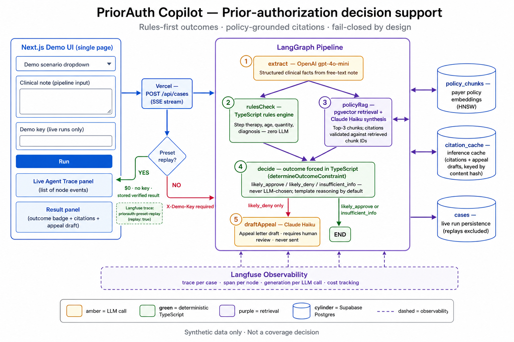
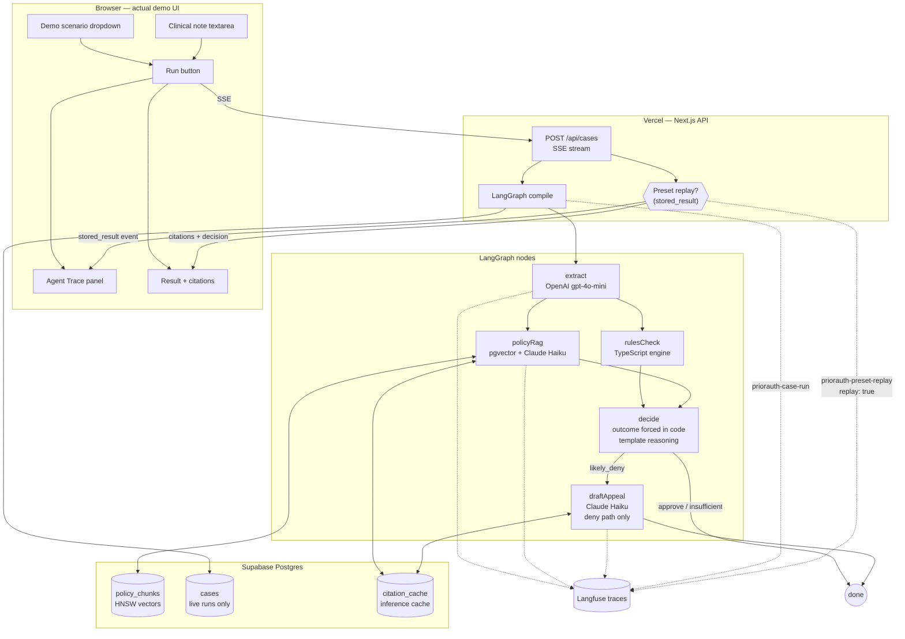
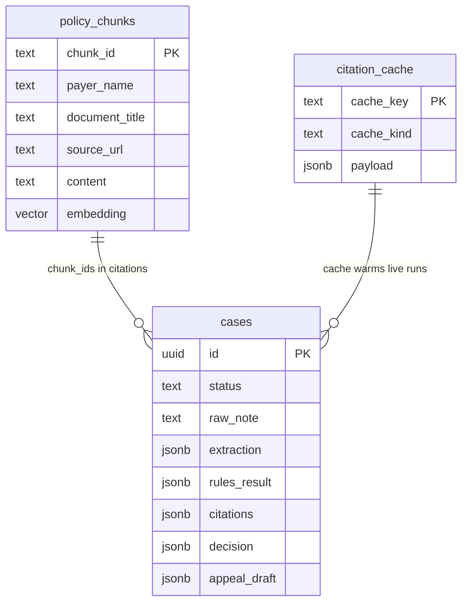

<p align="center">
  <strong>PriorAuth Copilot</strong><br/>
  LangGraph prior-authorization decision support — rules-first outcomes, policy-grounded citations, eval-gated quality.
</p>

<p align="center">
  <a href="https://priorauth-copilot-swart.vercel.app/"><strong>Live demo</strong></a> ·
  <a href="https://cloud.langfuse.com/project/cmrdrenon00chad0c3bi1gcoe">Langfuse</a> ·
  <a href="docs/MIGRATIONS.md">Migrations</a> ·
  <a href="docs/blueprint.md">Blueprint</a>
</p>

---

## At a glance

| | |
|---|---|
| **Problem** | Prior-auth reviewers need structured facts, payer policy citations, and a defensible approve/deny/insufficient signal — without the LLM inventing outcomes. |
| **Approach** | LangGraph pipeline: extract → rules + RAG in parallel → **code-forced outcome** → optional appeal draft. LLMs synthesize citations and prose; TypeScript owns the decision. |
| **Default demo** | [CASE-001 instant replay](https://priorauth-copilot-swart.vercel.app/) — **no API key, no LLM cost**, real CareSource PDF links |
| **Regression gate** | CI requires **100 / 0 / 100** on 26 golden cases (`workflow_dispatch`). Last full pass: pre-optimization — [`evals/results/2026-07-09T18-40-22-006Z.json`](evals/results/2026-07-09T18-40-22-006Z.json). Post-Round-2 re-verify pending. |
| **Stack** | Next.js 15 · LangGraph · OpenAI extract · Claude Haiku citations/appeals · Supabase pgvector · Langfuse |

---

## System design

<p align="center">
  
</p>

<p align="center"><sub>Diagram reflects the shipped system only — single-page demo, code-forced outcomes, honest preset replay path.</sub></p>

### Live pipeline (LangGraph)



### Request paths: replay vs live


### Data model



---

## Demo modes

| Scenario | Demo key | LLM | What you see |
|----------|----------|-----|--------------|
| **CASE-001** (default) | Not required | None | Stored verified run — CareSource citations, payer PDF URLs, honest `stored_result (replay)` trace |
| **CASE-004 / 008 / 017 / 025** | Required | Yes | Full live graph (deny + appeal on CASE-004 after credits + preset rebuild) |
| **Custom note + live** | Required | Yes | Real-time SSE node trace |

Open the [live app](https://priorauth-copilot-swart.vercel.app/) → keep **CASE-001** → click **Run (instant cached demo)**. Click any **source document** link — it resolves to a real payer PDF, not a placeholder.

---

## Who decides what

| Step | Engine | LLM? | Role |
|------|--------|------|------|
| Extraction | OpenAI `gpt-4o-mini` | Yes | Structured clinical facts from free text |
| Rules check | `lib/rulesEngine.ts` | **No** | Deterministic eligibility (step therapy, age, qty, diagnosis) |
| Policy RAG | pgvector + Claude Haiku | Yes (cacheable) | Retrieve chunks; synthesize **validated** citations |
| **Outcome** | `determineOutcomeConstraint()` | **No** | **Always code-set** — never LLM-chosen |
| Reasoning prose | `templateReasoning.ts` (default) | **No** | Rules + citation summaries + unverified items |
| Appeal draft | Claude Haiku | Yes (cacheable) | Deny-path letter only; human review required |

---

## Caching layers

| Layer | Key | Skips | Honest labeling |
|-------|-----|-------|-----------------|
| Preset replay | `presetCaseId` | Entire graph | UI banner + `replay: true` + Langfuse tag `replay` |
| Citation synthesis | `sha256(CPT + sorted chunk_ids)` | Haiku call | `citation_cache` table |
| Appeal draft | content-hash | Haiku call | same table, `cache_kind=appeal_draft` |
| Eval freshness | `--no-cache` flag | All inference cache | Used for regression runs |

Cached replays **do not insert** into `cases` — demo traffic does not pollute live case data.

---

<br/>

<details>
<summary><strong>Reference — setup, commands, eval, and operations</strong></summary>

### Local setup

```bash
git clone https://github.com/asorari09/priorauth-copilot.git
cd priorauth-copilot
npm install
cp .env.example .env    # fill keys
```

Apply migrations — see [`docs/MIGRATIONS.md`](docs/MIGRATIONS.md) (`0001_init.sql` then `0002_citation_cache.sql`).

```bash
npm run dev
```

### Environment

| Variable | Default | Purpose |
|----------|---------|---------|
| `REASONING_MODE` | `template` | `template` = zero-cost reasoning; `llm` = Haiku prose |
| `ANTHROPIC_MODEL_FAST` | `claude-haiku-4-5-20251001` | Citations + appeals |
| `DEMO_KEY` | — | Required for live API runs (not cached CASE-001) |
| `SUPABASE_*` | — | Policy RAG, cases, inference cache |
| `LANGFUSE_*` | — | Traces: `priorauth-case-run` / `priorauth-preset-replay` |

### API smoke tests

```bash
# Health
curl -s https://priorauth-copilot-swart.vercel.app/api/health

# Cached CASE-001 — no key
curl -N -X POST https://priorauth-copilot-swart.vercel.app/api/cases \
  -H "Content-Type: application/json" \
  -d '{"note":"<CASE-001 note>","presetCaseId":"CASE-001"}'

# Live run — key required
curl -N -X POST https://priorauth-copilot-swart.vercel.app/api/cases \
  -H "Content-Type: application/json" \
  -H "x-demo-key: $DEMO_KEY" \
  -d '{"note":"<note>","presetCaseId":"CASE-001","runLive":true}'
```

### Eval suite

26 synthetic golden cases in `data/goldenCases.json`.

```bash
npm run eval                      # uses inference cache
npm run eval -- --no-cache        # fresh synthesis (regression)
npm run eval -- --case CASE-001   # single spot check
npm run rebuild:presets           # rebuild demo JSON from Supabase (no LLM)
```

**CI:** every push → lint, tsc, vitest. **Eval** → manual `workflow_dispatch` only; exits non-zero unless **100 / 0 / 100**.

### Cost model (projections — verify with Langfuse after eval)

| Scenario | ~$/case | Billed |
|----------|---------|--------|
| Preset replay | **$0** | Nothing |
| Warm cache hit | ~$0.0001 | OpenAI extract only |
| First live approve | ~$0.004 | Extract + Haiku citations |
| First live deny | ~$0.007 | Above + Haiku appeal |

Baseline pre-optimization ~$0.045/case (Sonnet on citations + reasoning). Round 2 removes the decision LLM call and caches synthesis.

> **Resume / public claims:** treat cost and accuracy numbers as verified only after a passing `--no-cache` full eval and CI dispatch.

### Key files

| Path | Role |
|------|------|
| `app/api/cases/route.ts` | SSE API — replay vs live, demo key gate |
| `lib/graph/buildGraph.ts` | LangGraph wiring |
| `lib/graph/nodes.ts` | Extract, RAG, decide, appeal nodes |
| `lib/rulesEngine.ts` | Deterministic rules |
| `lib/cache/presetDemo.ts` | Preset + live-only manifest |
| `data/presetDemoResults.json` | Verified CASE-001 snapshot |
| `evals/runEvals.ts` | Eval runner + regression gate |
| `.github/workflows/ci.yml` | Quality + dispatch eval |

### Development

```bash
npm run lint && npx tsc --noEmit && npm test
```

### Observability

[Langfuse project](https://cloud.langfuse.com/project/cmrdrenon00chad0c3bi1gcoe) — filter live runs vs replays via trace name or `replay` metadata/tag.

</details>

---

<p align="center">
  <sub>Synthetic data only · Not a coverage decision · Verify with the payer directly</sub>
</p>
